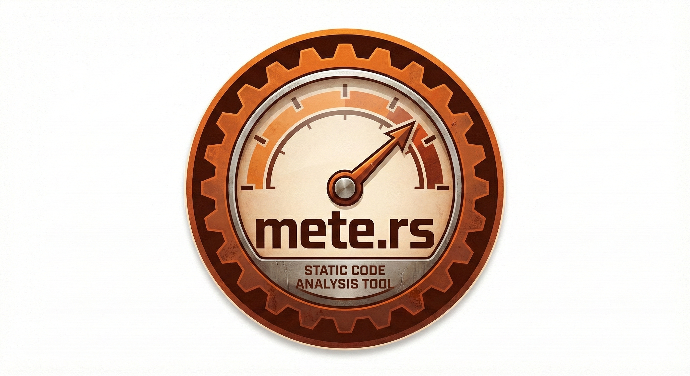

<p align="center">
  
</p>

<h1 align="center">mete</h1>

<p align="center">
  <strong>Structural metrics engine for code quality analysis</strong>
</p>

<p align="center">
  <a href="https://crates.io/crates/mete"></a>
  <a href="https://www.npmjs.com/package/@dutch.casa/mete-rs"></a>
  <a href="https://github.com/dutch-casa/mete.rs"></a>
  <a href="https://crates.io/crates/mete"></a>
  <a href="https://www.npmjs.com/package/@dutch.casa/mete-rs"></a>
  <a href="https://github.com/dutch-casa/mete.rs/blob/main/LICENSE"></a>
</p>

<p align="center">
  <a href="#install-as-mcp-server">MCP Server</a> |
  <a href="#cli-usage">CLI Usage</a> |
  <a href="#metrics">Metrics</a> |
  <a href="#installation">Installation</a>
</p>

---

## What is mete?

mete analyzes your codebase and reports structural quality metrics:

- **Maintainability Index (MI)** - Overall code health score (0-100)
- **Cyclomatic Complexity (CC)** - Number of independent paths through code
- **Cognitive Complexity** - How hard code is to understand
- **Nesting Depth** - Maximum control structure depth
- **Code Duplication** - Repeated code blocks across files
- **Structural Entropy** - Complexity distribution via Shannon entropy

Supports: Rust, TypeScript, JavaScript, Python, Go, Java, C#, C++, Elixir

---

## Install as MCP Server

mete works as an MCP (Model Context Protocol) server, giving AI assistants direct access to code quality analysis.

### Claude Code

```bash
claude mcp add mete -- mete mcp
```

### Cursor

<a href="cursor://anysphere.cursor-deeplink/mcp/install?name=mete&config=eyJjb21tYW5kIjoibWV0ZSIsImFyZ3MiOlsibWNwIl19">
  
</a>

Or manually add to `~/.cursor/mcp.json`:

```json
{
  "mcpServers": {
    "mete": {
      "command": "mete",
      "args": ["mcp"]
    }
  }
}
```

### VS Code

Add to your VS Code MCP settings:

```json
{
  "mcp": {
    "servers": {
      "mete": {
        "command": "mete",
        "args": ["mcp"]
      }
    }
  }
}
```

### OpenCode

Add to `~/.config/opencode/config.json`:

```json
{
  "mcp": {
    "mete": {
      "command": "mete",
      "args": ["mcp"]
    }
  }
}
```

### MCP Tools Available

| Tool | Description |
|------|-------------|
| `analyze` | File/directory quality metrics (MI, CC, cognitive complexity, depth) |
| `targets` | AI-friendly refactoring suggestions sorted by priority |
| `functions` | Function-level metrics with filtering by complexity/size/depth |
| `duplicates` | Detect duplicate code blocks (exact and cross-file similar) |
| `entropy` | Measure structural complexity distribution |

---

## Installation

### From crates.io (Rust)

```bash
cargo install mete --features mcp
```

### From npm (Node.js)

```bash
npm install -g @dutch.casa/mete-rs
```

### From source

```bash
git clone https://github.com/dutch-casa/mete.rs
cd mete.rs
cargo install --path . --features mcp
```

---

## CLI Usage

### Analyze a file or directory

```bash
mete analyze src/
mete analyze src/main.rs
```

### Find refactoring targets (AI-friendly)

```bash
mete targets src/ --limit 10
```

### Function-level metrics

```bash
mete functions src/ --complex    # Show only complex functions
mete functions src/ --large      # Show only large functions (>50 LOC)
mete functions src/ --deep       # Show only deeply nested functions
```

### Find duplicate code

```bash
mete duplicates src/
mete duplicates src/ --cross-file --threshold 0.8
```

### Measure structural entropy

```bash
mete entropy src/
```

### Explain metrics

```bash
mete explain mi
mete explain cc
mete explain depth
```

---

## Metrics

### Maintainability Index (MI)

Measures code maintainability on a scale of 0-100. Higher is better.

| Range | Rating |
|-------|--------|
| 85-100 | Excellent |
| 65-84 | Good |
| 50-64 | Moderate |
| 0-49 | Poor |

### Cyclomatic Complexity (CC)

Number of linearly independent paths through code. Lower is better.

| Range | Rating |
|-------|--------|
| 1-5 | Simple |
| 6-10 | Moderate |
| 11-20 | Complex |
| 21+ | Very Complex |

### Nesting Depth

Maximum depth of nested control structures. Lower is better.

| Range | Rating |
|-------|--------|
| 1-2 | Flat |
| 3-4 | Moderate |
| 5-6 | Deep |
| 7+ | Very Deep |

---

## Star History

<a href="https://star-history.com/#dutch-casa/mete.rs&Date">
 <picture>
   <source media="(prefers-color-scheme: dark)" srcset="https://api.star-history.com/svg?repos=dutch-casa/mete.rs&type=Date&theme=dark" />
   <source media="(prefers-color-scheme: light)" srcset="https://api.star-history.com/svg?repos=dutch-casa/mete.rs&type=Date" />
   
 </picture>
</a>

---

## License

MIT
